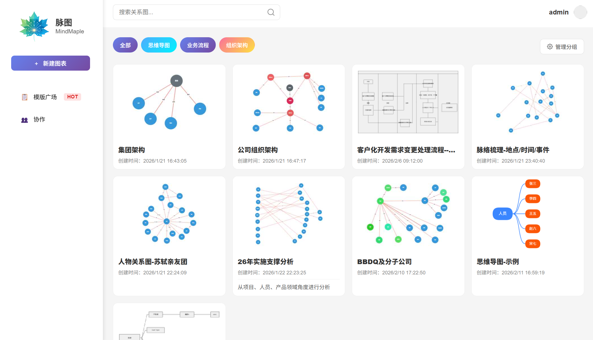
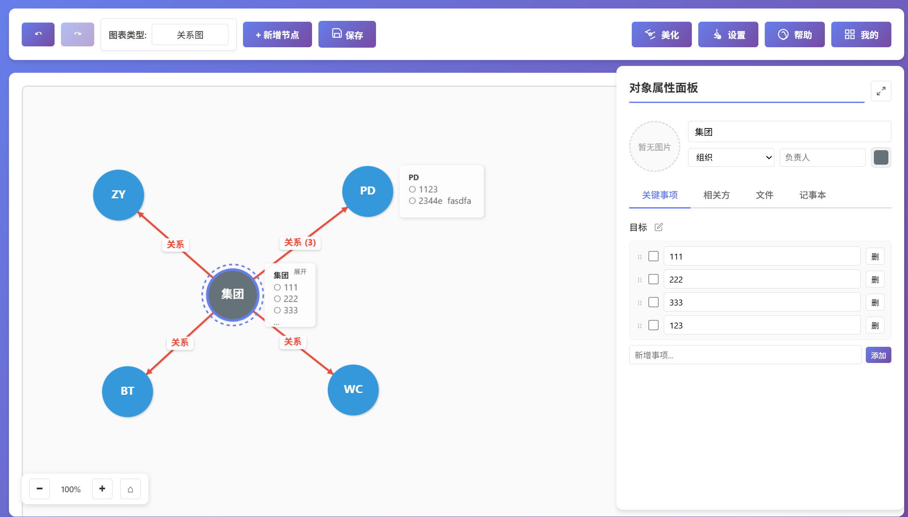
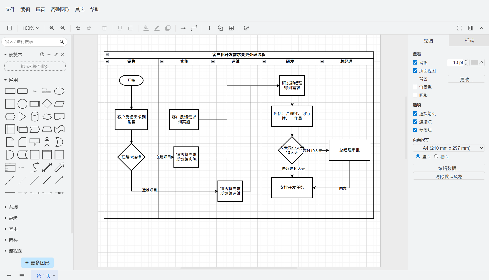
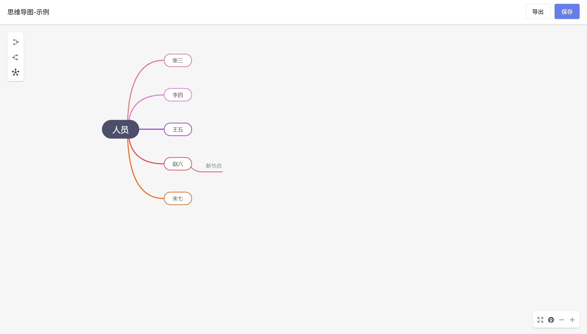

# 脉图 - 多功能可视化图表编辑器

## 项目概述

脉图是一个基于 Node.js 的多功能可视化图表编辑器，支持关系图谱、流程图和思维导图的创建、编辑和管理。系统提供直观的可视化界面，让用户能够轻松绘制和管理各种复杂的图表结构，同时支持数据的持久化存储和多设备访问。

## 核心价值

1. **一站式图表解决方案** - 集成多种图表类型，满足不同场景的可视化需求
2. **直观的用户界面** - 拖拽式编辑，所见即所得的操作体验
3. **数据持久化存储** - 自动保存图表数据和缩略图，确保数据安全
4. **多设备兼容** - 响应式设计，支持在不同设备上访问和编辑
5. **高性能处理** - 优化的数据库操作和前端渲染，确保流畅的用户体验

## 技术栈

- **后端**: Node.js + Express
- **数据库**: MySQL (使用 mysql2 驱动)
- **前端**: HTML + CSS + JavaScript (原生)
- **图表库**: 
  - 关系图: 原生实现
  - 流程图: 基于Drawio实现（对Drawio部分功能进行了调整）
  - 思维导图: MindElixir (v5.8.0)
- **其他**: Session 管理、文件上传/下载

## 核心功能

### 1. 多种图表类型

- **关系图谱**: 支持节点和边的可视化编辑，适用于人物关系、组织架构、知识图谱等场景
- **流程图**: 支持流程步骤的可视化编排，适用于业务流程、工作流等场景
- **思维导图**: 支持层级结构的可视化展示，适用于头脑风暴、知识管理等场景

### 2. 智能编辑功能

- **拖拽式编辑**: 支持节点的拖拽移动和位置调整
- **自动保存**: 编辑过程中自动保存，避免数据丢失
- **实时预览**: 缩略图实时更新，直观展示图表结构
- **响应式布局**: 自适应不同屏幕尺寸

### 3. 数据管理

- **图表管理**: 创建、编辑、删除、分组管理图表
- **数据导入/导出**: 支持 JSON 格式的数据导入导出
- **缩略图生成**: 自动生成图表缩略图，便于快速预览
- **历史记录**: 保存图表编辑历史

### 4. 系统特性

- **用户认证**: 支持模拟登录和微信扫码登录
- **分组管理**: 支持图表分组，便于分类管理
- **权限控制**: 基于用户的权限管理
- **性能优化**: 数据库连接池、异步操作、缓存机制

## 系统截图

### 1. 登录界面


### 2. 主界面



### 3. 关系图编辑器



### 4. 流程图编辑器



### 5. 思维导图编辑器



## 安装说明

### 前置条件

1. **Node.js** - 建议 v16.x 或更高版本
2. **MySQL** - 建议 5.7+ 或 8.0+

### 安装步骤

1. **克隆项目**
```bash
git clone <repository-url>
cd <project-directory>
```

2. **安装依赖**
```bash
npm install
```

3. **配置 MySQL 数据库**
   - 使用数据库备份还原即可

5. **启动服务**
```bash
npm start
```
```b
启动Drawio服务：
\links\drawio\src\main\webapp\startup.bat
```

6. **访问应用**
```
http://localhost:3000
```

## 数据库配置

### 默认配置

```javascript
const DB_CONFIG = {
    host: process.env.DB_HOST || 'localhost',
    user: process.env.DB_USER || 'root',
    password: process.env.DB_PASSWORD || '',
    database: process.env.DB_NAME || 'graph_editor',
    port: process.env.DB_PORT || 3306,
    waitForConnections: true,
    connectionLimit: 10,
    queueLimit: 0,
    drawioUrl: process.env.DRAWIO_URL || 'http://localhost:8080',
    apiBaseUrl: process.env.APIBASE_URL || 'http://localhost:3000'
};
```

## 贡献指南

欢迎提交 Issue 和 Pull Request！

## 许可证

MIT License
